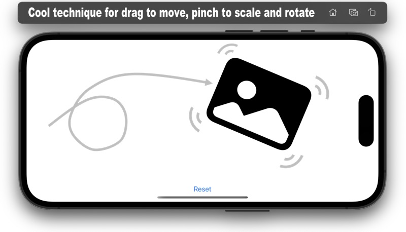
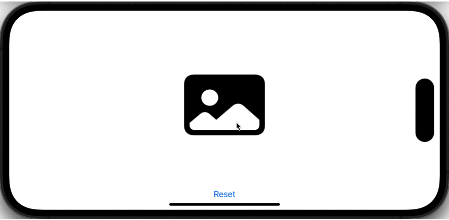

## DragAndPinchView
### How to implement moving, scaling, and rotation gestures simultaneously in SwiftUI.
<p align="center">
  
</p>

When considering the implementation of drag moving, scaling, and rotating image 'object' in SwiftUI, we usually encounter problems with drawing coordinates if we write code based on Apple documents or Internet articles.
For example, the cursor position is out of object when moving, the center of scaling is off, the center of rotation is off, and so on.

Then, this problem can be easily solved by paying attention to the modifier order of the target View.

Modifiers order to note following:
```swift
Image(systemName: "photo.fill") // sample drag image
// the following order is required for coordinate match
    .rotationEffect(angle, anchor: .center) // rotationEffect must be first
    .scaleEffect(scale) // scale must be after rotationEffect
    .offset(offset) // offset is last
```

### Simple code that works well, without correction of coordinates


```swift
import SwiftUI

struct ContentView: View {
    @State var offset:CGSize = .zero // drag value
    @State var lastOffset: CGSize = .zero // hold last drag value

    @State var scale:CGFloat = 1.0 // pinch scale value
    @State var lastScale: CGFloat = 1.0 // hold last scale value

    @State var angle:Angle = .zero // pinch angle value
    @State var lastAngle:Angle = .zero // hold last angle value

    let minScale = 0.2 // minimum scale value
    let maxScale = 5.0 // maximum scale value

    let imageWidth:CGFloat  = 160 // object width  for initial placement
    let imageHeight:CGFloat = 120 // object height for initial placement

    var dragGesture: some Gesture {
        DragGesture()
            .onChanged {
                offset = CGSize(width: lastOffset.width + $0.translation.width, height: lastOffset.height + $0.translation.height)
            }
            .onEnded{ _ in
                lastOffset = offset
            }
    }
    var scaleGuesture: some Gesture {
        MagnificationGesture()
            .onChanged {
                if ($0 > minScale) && ($0 < maxScale) { // scaling range for pinch
                    scale = $0 * lastScale
                }
            }
            .onEnded{ _ in
                lastScale = scale
            }
    }
    var rotateGesture: some Gesture {
        RotationGesture(minimumAngleDelta: .degrees(8)) // minimun start angle = 8degrees
            .onChanged {
                angle = $0 + lastAngle
            }
            .onEnded { _ in
                lastAngle = angle
            }
    }

    var body: some View {
        ZStack {

            Image(systemName: "photo.fill") // sample drag image
                .resizable()
                .frame(width: imageWidth, height: imageHeight) // placement size
            // the following order is required for coordinate match
                .rotationEffect(angle, anchor: .center) // rotationEffect must be first
                .scaleEffect(scale) // scale must be after rotationEffect
                .offset(offset) // offset is last
            // multiple gesture :Drag to move, Pinch to scale, Pinch to rotate
                .gesture(dragGesture)
                .gesture(SimultaneousGesture(rotateGesture, scaleGuesture))

            VStack {
                Spacer()
                Button(action: {
                    offset = .zero; lastOffset = .zero
                    scale = 1.0; lastScale = 1.0
                    angle = .zero; lastAngle = .zero
                }, label: { Text("Reset") } )
            }
        }
    }
}
   :
```

Download the SwiftUI project code and give it a try.
